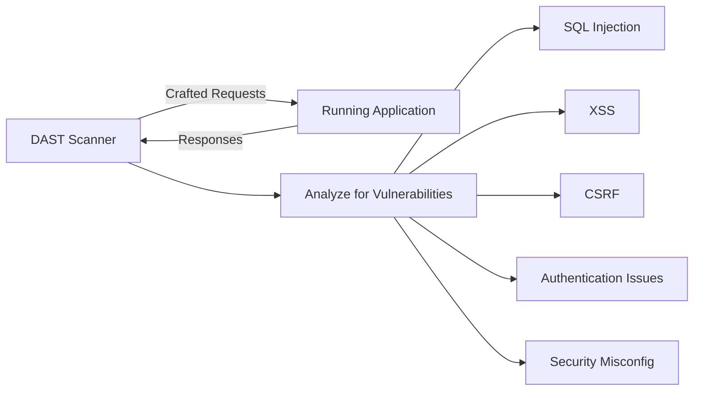

# DAST — Dynamic Application Security Testing

## What is DAST?

DAST tests a running application from the **outside** — like an attacker would. It sends crafted HTTP requests and analyzes responses to find vulnerabilities. This is a black-box testing technique.



## SAST vs DAST

| Aspect | SAST | DAST |
|--------|------|------|
| **Approach** | White-box (source code) | Black-box (running app) |
| **When** | Build time | Runtime / staging |
| **Speed** | Fast | Slower (needs running app) |
| **False Positives** | Higher | Lower |
| **Coverage** | All code paths | Only reachable paths |
| **Language Dependent** | Yes | No |
| **Finds** | Code-level flaws | Runtime vulnerabilities |

Use **both** — they complement each other.

## OWASP ZAP

The most popular open-source DAST tool.

### Quick Start

```bash
# Run ZAP baseline scan
docker run -t zaproxy/zap-stable zap-baseline.py \
  -t https://staging.example.com

# Full scan (more thorough, slower)
docker run -t zaproxy/zap-stable zap-full-scan.py \
  -t https://staging.example.com

# API scan
docker run -t zaproxy/zap-stable zap-api-scan.py \
  -t https://staging.example.com/openapi.json \
  -f openapi
```

### CI/CD Integration

```yaml
# GitHub Actions
- name: ZAP Baseline Scan
  uses: zaproxy/action-baseline@v0.9.0
  with:
    target: 'https://staging.example.com'
    rules_file_name: '.zap/rules.tsv'
    fail_action: 'true'
    allow_issue_writing: 'false'

# ZAP rules file (.zap/rules.tsv)
# Rule ID    Action    Description
# 10021      IGNORE    X-Content-Type-Options (handled by CDN)
# 10038      WARN      Content Security Policy
```

### Authenticated Scanning

```yaml
# ZAP automation framework
env:
  contexts:
    - name: "My App"
      urls:
        - "https://staging.example.com"
      authentication:
        method: "form"
        parameters:
          loginUrl: "https://staging.example.com/login"
          loginRequestData: "username=&password="
        verification:
          method: "response"
          loggedInRegex: "\\QWelcome\\E"
      users:
        - name: "test-user"
          credentials:
            username: "${DAST_USERNAME}"
            password: "${DAST_PASSWORD}"

jobs:
  - type: spider
    parameters:
      context: "My App"
      user: "test-user"
      maxDuration: 5
  - type: activeScan
    parameters:
      context: "My App"
      user: "test-user"
  - type: report
    parameters:
      template: "sarif-json"
      reportFile: "zap-report.sarif"
```

## Nuclei

Fast vulnerability scanner with community templates:

```bash
# Install
go install -v github.com/projectdiscovery/nuclei/v3/cmd/nuclei@latest

# Scan with all templates
nuclei -u https://staging.example.com

# Scan with specific templates
nuclei -u https://staging.example.com -t cves/ -t misconfigurations/

# Scan with severity filter
nuclei -u https://staging.example.com -severity critical,high
```

## DAST Best Practices

### When to Scan

| Scan Type | Frequency | Environment |
|-----------|-----------|-------------|
| Baseline scan | Every PR/deploy | Staging |
| Full scan | Weekly | Staging |
| Authenticated scan | Weekly | Staging |
| API scan | Every PR/deploy | Staging |

### Safe Scanning

!!! warning "DAST Can Be Destructive"
    DAST tools send real attacks (SQL injection, XSS payloads). **Never** run DAST against production without proper controls.

**Safety measures:**

- Run against staging/test environments only
- Use dedicated test accounts
- Disable dangerous scan modules (DoS, data modification)
- Schedule scans during low-traffic windows
- Have rollback procedures ready

### Handling Results

1. **Validate findings** — manually verify critical findings
2. **Correlate with SAST** — matching findings in both tools are high-confidence
3. **Prioritize by exploitability** — focus on easily exploitable issues first
4. **Fix in code** — don't just add WAF rules, fix the root cause
5. **Retest** — verify fixes with targeted re-scan
