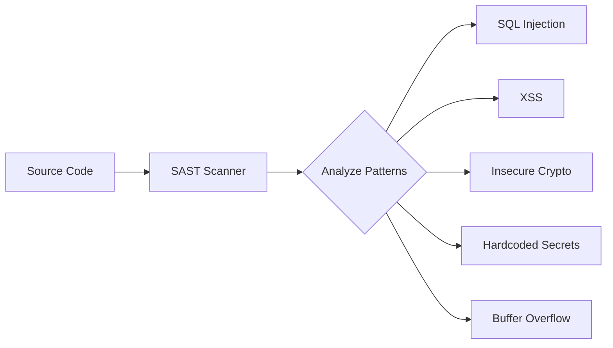

# SAST — Static Application Security Testing

## What is SAST?

SAST analyzes **source code** (or bytecode/binary) to find security vulnerabilities **without executing** the application. It's a white-box testing technique that examines code from the inside.



## When to Run SAST

| Phase | Approach |
|-------|----------|
| **IDE** | Real-time feedback via plugins (SonarLint, Snyk) |
| **Pre-commit** | Quick scan of changed files |
| **Pull Request** | Full scan, block merge on critical findings |
| **Nightly** | Comprehensive scan of entire codebase |

## Popular SAST Tools

| Tool | Languages | License | Best For |
|------|-----------|---------|----------|
| **Semgrep** | 30+ languages | OSS + Commercial | Custom rules, speed |
| **SonarQube** | 30+ languages | OSS + Commercial | Enterprise, quality + security |
| **CodeQL** | 10+ languages | Free for OSS | GitHub integration, deep analysis |
| **Bandit** | Python | OSS | Python-specific |
| **Gosec** | Go | OSS | Go-specific |
| **Brakeman** | Ruby/Rails | OSS | Rails-specific |
| **SpotBugs + FindSecBugs** | Java | OSS | Java-specific |

## Semgrep

### Basic Usage

```bash
# Install
pip install semgrep

# Run with default security rules
semgrep --config auto .

# Run OWASP Top 10 rules
semgrep --config p/owasp-top-ten .

# Run specific rulesets
semgrep --config p/security-audit --config p/secrets .
```

### Custom Rules

```yaml
# .semgrep/custom-rules.yml
rules:
  - id: no-eval
    patterns:
      - pattern: eval(...)
    message: "Avoid eval() — it can lead to code injection"
    severity: ERROR
    languages: [python, javascript]

  - id: sql-injection
    patterns:
      - pattern: |
          cursor.execute(f"... {$VAR} ...")
      - pattern: |
          cursor.execute("..." + $VAR + "...")
    message: "Possible SQL injection. Use parameterized queries."
    severity: ERROR
    languages: [python]
    fix: |
      cursor.execute("... %s ...", ($VAR,))

  - id: insecure-hash
    pattern: hashlib.md5(...)
    message: "MD5 is cryptographically broken. Use SHA-256 or better."
    severity: WARNING
    languages: [python]
```

### CI Integration

```yaml
- name: Semgrep SAST
  uses: returntocorp/semgrep-action@v1
  with:
    config: >-
      p/security-audit
      p/owasp-top-ten
      p/secrets
      .semgrep/
    generateSarif: "1"

- name: Upload SARIF
  uses: github/codeql-action/upload-sarif@v3
  with:
    sarif_file: semgrep.sarif
```

## CodeQL

### Setup

```yaml
# .github/workflows/codeql.yml
name: CodeQL Analysis

on:
  push:
    branches: [main]
  pull_request:
    branches: [main]
  schedule:
    - cron: '0 6 * * 1'  # Weekly deep scan

jobs:
  analyze:
    runs-on: ubuntu-latest
    permissions:
      security-events: write
    strategy:
      matrix:
        language: [javascript, python]
    steps:
      - uses: actions/checkout@v4

      - name: Initialize CodeQL
        uses: github/codeql-action/init@v3
        with:
          languages: ${{ matrix.language }}
          queries: security-extended

      - name: Autobuild
        uses: github/codeql-action/autobuild@v3

      - name: Perform Analysis
        uses: github/codeql-action/analyze@v3
```

## Handling SAST Results

### Triage Process

```
Finding Triage:
├── True Positive → Fix immediately (Critical/High)
│   ├── Create ticket
│   ├── Assign to developer
│   └── Track SLA compliance
├── True Positive → Schedule fix (Medium/Low)
│   └── Add to security backlog
├── False Positive → Suppress with justification
│   └── Document why it's a false positive
└── Won't Fix → Accept risk with approval
    └── Document risk acceptance
```

### Reducing False Positives

1. **Tune rules** — disable overly noisy rules
2. **Add context** — use type-aware analysis (CodeQL > regex)
3. **Baseline** — ignore pre-existing findings, focus on new code
4. **Custom rules** — write rules specific to your codebase
5. **Feedback loop** — developers report false positives to improve rules

## SAST Metrics

| Metric | Target |
|--------|--------|
| Scan coverage | 100% of repos |
| Mean time to triage | < 2 business days |
| False positive rate | < 20% |
| Critical finding SLA | Fix within 7 days |
| High finding SLA | Fix within 30 days |
