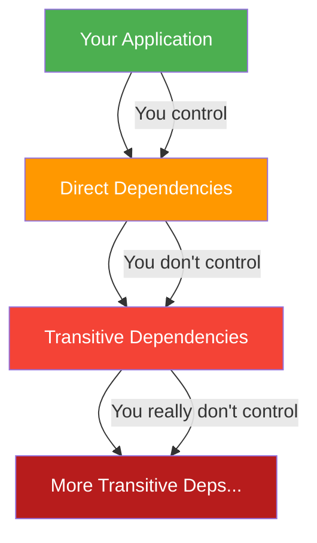

# SCA — Software Composition Analysis

## What is SCA?

SCA identifies and analyzes **open-source components** in your application to find known vulnerabilities, license compliance issues, and outdated dependencies.

> 80-90% of modern applications are made up of open-source components. You're only as secure as your weakest dependency.

## The Software Supply Chain



## SCA Tools

| Tool | License | Highlights |
|------|---------|------------|
| **Snyk** | Freemium | Best fix suggestions, IDE integration |
| **Dependabot** | Free (GitHub) | Native GitHub integration, auto-PRs |
| **Renovate** | OSS | Highly configurable, multi-platform |
| **OWASP Dependency-Check** | OSS | NVD-based, CI-friendly |
| **Grype** | OSS (Anchore) | Fast, SBOM-aware |
| **npm audit** | Built-in | Node.js native |

## Dependabot

### Configuration

```yaml
# .github/dependabot.yml
version: 2
updates:
  # npm dependencies
  - package-ecosystem: "npm"
    directory: "/"
    schedule:
      interval: "weekly"
      day: "monday"
    open-pull-requests-limit: 10
    labels:
      - "dependencies"
      - "security"
    reviewers:
      - "security-team"
    groups:
      # Group minor/patch updates together
      production-deps:
        patterns:
          - "*"
        update-types:
          - "minor"
          - "patch"

  # Docker base images
  - package-ecosystem: "docker"
    directory: "/"
    schedule:
      interval: "weekly"

  # GitHub Actions
  - package-ecosystem: "github-actions"
    directory: "/"
    schedule:
      interval: "weekly"

  # Python dependencies
  - package-ecosystem: "pip"
    directory: "/"
    schedule:
      interval: "weekly"
```

### Security Updates

Dependabot automatically creates PRs for known vulnerabilities:

```
Dependabot alert:
├── CVE-2024-XXXX in lodash@4.17.20
├── Severity: Critical
├── Fix available: Upgrade to 4.17.21
└── Auto-PR: Created (if enabled)
```

## Snyk

```bash
# Test for vulnerabilities
snyk test

# Monitor project (continuous scanning)
snyk monitor

# Test with severity threshold
snyk test --severity-threshold=high

# Test container image
snyk container test myapp:latest

# Test IaC
snyk iac test ./terraform

# Fix vulnerabilities (interactive)
snyk fix
```

### CI Integration

```yaml
- name: Snyk Security Check
  uses: snyk/actions/node@master
  env:
    SNYK_TOKEN: ${{ secrets.SNYK_TOKEN }}
  with:
    args: >-
      --severity-threshold=high
      --fail-on=upgradable
```

## Vulnerability Management

### Prioritization Framework

Not all vulnerabilities are equal. Prioritize based on:

| Factor | Weight | Description |
|--------|--------|-------------|
| **CVSS Score** | High | Base severity rating |
| **Exploitability** | Critical | Is there a public exploit? |
| **Reachability** | Critical | Is the vulnerable function actually called? |
| **Environment** | Medium | Internet-facing vs. internal |
| **Fix Available** | Medium | Can it be fixed easily? |
| **Data Sensitivity** | High | Does it handle sensitive data? |

### Response SLAs

| Severity | Response Time | Fix Time |
|----------|---------------|----------|
| Critical (CVSS 9.0+) | 24 hours | 7 days |
| High (CVSS 7.0-8.9) | 3 days | 30 days |
| Medium (CVSS 4.0-6.9) | 7 days | 90 days |
| Low (CVSS 0.1-3.9) | 30 days | Next release |

## License Compliance

SCA tools also track open-source licenses:

| License | Commercial Use | Distribution Risk |
|---------|---------------|-------------------|
| MIT | Yes | Low |
| Apache 2.0 | Yes | Low |
| BSD | Yes | Low |
| GPL v3 | Careful | High (copyleft) |
| AGPL v3 | Careful | Very High (network copyleft) |
| SSPL | No | Very High |

```yaml
# Snyk license policy
snyk test --license-policy-file=license-policy.json
```

## Best Practices

1. **Scan continuously** — not just at build time
2. **Update regularly** — don't let dependencies age
3. **Monitor advisories** — subscribe to security feeds
4. **Generate SBOMs** — know what's in your software
5. **Pin versions** — use exact versions in lock files
6. **Audit transitive deps** — your deps' deps matter
7. **Have a policy** — define acceptable risk and license terms
