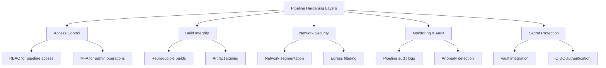

# Pipeline Hardening

## Defense in Depth for CI/CD

Apply multiple layers of security controls to protect your pipeline.



## Access Control

### Role-Based Access

```yaml
# GitHub: Use environment protection rules
environments:
  production:
    required_reviewers:
      - security-team-lead
      - platform-team-lead
    deployment_branch_policy:
      protected_branches: true
    wait_timer: 30  # 30-minute delay for review
```

### Deployment Approvals

```yaml
jobs:
  deploy-staging:
    runs-on: ubuntu-latest
    environment: staging
    steps:
      - name: Deploy to Staging
        run: ./deploy.sh staging

  deploy-production:
    needs: deploy-staging
    runs-on: ubuntu-latest
    environment: production  # Requires manual approval
    steps:
      - name: Deploy to Production
        run: ./deploy.sh production
```

## Reproducible Builds

Ensure the same source code always produces the same output.

### Principles

1. **Pin all dependencies** — exact versions, verified checksums
2. **Hermetic builds** — no network access during build
3. **Deterministic toolchain** — same compiler, same flags, same output
4. **Capture build environment** — record all build inputs

```dockerfile
# Reproducible Docker build
FROM node:20.11.0-alpine3.19@sha256:abc123...  AS build
WORKDIR /app
COPY package.json package-lock.json ./
RUN npm ci --ignore-scripts
COPY . .
RUN npm run build

FROM node:20.11.0-alpine3.19@sha256:abc123...
WORKDIR /app
COPY --from=build /app/dist ./dist
COPY --from=build /app/node_modules ./node_modules
USER node
CMD ["node", "dist/server.js"]
```

## Artifact Integrity

### Signing Pipeline

```bash
# 1. Build artifact
docker build -t myapp:v1.0.0 .

# 2. Generate SBOM
syft myapp:v1.0.0 -o spdx-json > sbom.json

# 3. Sign the image
cosign sign --key cosign.key myapp:v1.0.0

# 4. Attach SBOM as attestation
cosign attest --key cosign.key --predicate sbom.json myapp:v1.0.0

# 5. Verify before deployment
cosign verify --key cosign.pub myapp:v1.0.0
cosign verify-attestation --key cosign.pub myapp:v1.0.0
```

### Admission Control

Enforce that only signed images can be deployed:

```yaml
# Kubernetes: Kyverno policy
apiVersion: kyverno.io/v1
kind: ClusterPolicy
metadata:
  name: verify-image-signature
spec:
  validationFailureAction: Enforce
  rules:
    - name: verify-cosign-signature
      match:
        any:
          - resources:
              kinds:
                - Pod
      verifyImages:
        - imageReferences:
            - "myregistry/*"
          attestors:
            - entries:
                - keys:
                    publicKeys: |-
                      -----BEGIN PUBLIC KEY-----
                      ...
                      -----END PUBLIC KEY-----
```

## Pipeline Isolation

### Job Isolation

```yaml
jobs:
  # Each job runs in a fresh environment
  test:
    runs-on: ubuntu-latest
    steps:
      - run: npm test

  # Security scan in separate job - no access to deploy secrets
  security-scan:
    runs-on: ubuntu-latest
    steps:
      - run: npm audit

  # Deploy job - separate environment with deploy secrets
  deploy:
    needs: [test, security-scan]
    runs-on: ubuntu-latest
    environment: production
    steps:
      - run: ./deploy.sh
```

## Emergency Controls

### Pipeline Kill Switch

```yaml
# Check for emergency stop before deploying
- name: Check deployment freeze
  run: |
    FREEZE=$(gh variable get DEPLOYMENT_FREEZE 2>/dev/null || echo "false")
    if [ "$FREEZE" = "true" ]; then
      echo "Deployment freeze is active. Aborting."
      exit 1
    fi
```

### Automated Rollback

```yaml
- name: Deploy with rollback
  run: |
    # Deploy new version
    kubectl apply -f k8s/deployment.yaml

    # Wait and verify health
    if ! kubectl rollout status deployment/myapp --timeout=300s; then
      echo "Deployment failed - rolling back"
      kubectl rollout undo deployment/myapp
      exit 1
    fi

    # Run smoke tests
    if ! ./smoke-tests.sh; then
      echo "Smoke tests failed - rolling back"
      kubectl rollout undo deployment/myapp
      exit 1
    fi
```
