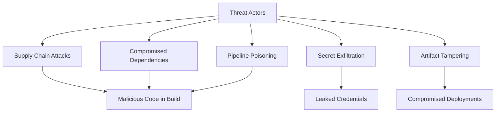

# Secure CI/CD Pipelines

## Pipeline Threat Model

CI/CD pipelines are high-value targets because they have access to production credentials, can modify deployed code, and often have elevated permissions.



## Pipeline Security Principles

### 1. Least Privilege

Every pipeline component should have only the minimum permissions it needs.

```yaml
# Bad: Over-privileged pipeline
permissions:
  contents: write
  packages: write
  deployments: write
  issues: write          # Not needed
  pull-requests: write   # Not needed
  actions: write         # Not needed

# Good: Minimal permissions
permissions:
  contents: read
  packages: write
```

### 2. Immutable Build Environments

Use fresh, ephemeral environments for each build.

```yaml
jobs:
  build:
    runs-on: ubuntu-latest  # Fresh VM each time
    container:
      image: node:20-slim    # Pinned, minimal base image
    steps:
      - uses: actions/checkout@v4
      - run: npm ci           # Clean install from lock file
```

### 3. Pin Dependencies and Actions

```yaml
# Bad: Mutable tag (can be overwritten by attacker)
- uses: actions/checkout@v4

# Good: Pinned to specific commit SHA
- uses: actions/checkout@b4ffde65f46336ab88eb53be808477a3936bae11 # v4.1.1
```

**Automate SHA pinning:**

```bash
# Use step-security/secure-repo to pin actions
npx @step-security/secure-repo
```

### 4. Build Provenance and Attestation

Generate provenance to prove where and how artifacts were built:

```yaml
- name: Generate SLSA Provenance
  uses: slsa-framework/slsa-github-generator/.github/workflows/generator_generic_slsa3.yml@v1.9.0
  with:
    base64-subjects: "${{ needs.build.outputs.digest }}"
```

## Securing Build Artifacts

### Container Image Signing

```bash
# Sign with Cosign (Sigstore)
cosign sign --key cosign.key myregistry/myapp:v1.0.0

# Verify signature before deployment
cosign verify --key cosign.pub myregistry/myapp:v1.0.0
```

### Software Bill of Materials (SBOM)

```bash
# Generate SBOM with Syft
syft myregistry/myapp:v1.0.0 -o spdx-json > sbom.json

# Scan SBOM for vulnerabilities
grype sbom:sbom.json
```

## Pipeline Secret Handling

### Do's and Don'ts

| Do | Don't |
|----|-------|
| Use native secret stores | Hardcode secrets in pipeline files |
| Mask secrets in logs | Print environment variables |
| Use OIDC for cloud auth | Use long-lived access keys |
| Rotate pipeline secrets regularly | Share secrets across environments |
| Limit secret scope to specific jobs | Grant secrets to all jobs |

### OIDC Authentication (Keyless)

Instead of storing cloud credentials, use OIDC:

```yaml
# GitHub Actions to AWS (no stored credentials)
permissions:
  id-token: write
  contents: read

jobs:
  deploy:
    runs-on: ubuntu-latest
    steps:
      - name: Configure AWS Credentials
        uses: aws-actions/configure-aws-credentials@v4
        with:
          role-to-assume: arn:aws:iam::123456789012:role/github-actions
          aws-region: us-east-1
          # No access key needed - uses OIDC token exchange
```

## Supply Chain Security

### SLSA Framework

Supply-chain Levels for Software Artifacts — a framework for ensuring artifact integrity.

| SLSA Level | Requirements |
|------------|-------------|
| **Level 1** | Documented build process |
| **Level 2** | Hosted build service, signed provenance |
| **Level 3** | Hardened build platform, non-falsifiable provenance |
| **Level 4** | Two-party review, hermetic builds |

### Dependency Verification

```yaml
# Verify dependency checksums
- name: Verify npm integrity
  run: npm audit signatures

# Lock file verification
- name: Check lock file integrity
  run: |
    npm ci --ignore-scripts
    git diff --exit-code package-lock.json
```

## Network Security in Pipelines

```yaml
# Restrict outbound network access
jobs:
  build:
    runs-on: ubuntu-latest
    steps:
      - name: Harden Runner
        uses: step-security/harden-runner@v2
        with:
          egress-policy: audit  # or 'block'
          allowed-endpoints: >
            github.com:443
            registry.npmjs.org:443
            api.nuget.org:443
```

## Pipeline Audit and Monitoring

Monitor your pipelines for suspicious activity:

- Unexpected workflow modifications
- Secrets accessed by unusual jobs
- Build artifacts with unexpected contents
- Pipeline runs from unexpected branches or forks
- Elevated permission usage
