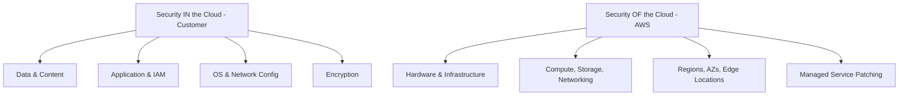

# AWS Security

## AWS Shared Responsibility Model



## IAM Security

### IAM Best Practices

```json
{
  "Version": "2012-10-17",
  "Statement": [
    {
      "Sid": "LeastPrivilegeS3",
      "Effect": "Allow",
      "Action": [
        "s3:GetObject",
        "s3:PutObject"
      ],
      "Resource": "arn:aws:s3:::my-bucket/app-data/*",
      "Condition": {
        "StringEquals": {
          "s3:x-amz-server-side-encryption": "aws:kms"
        },
        "IpAddress": {
          "aws:SourceIp": "10.0.0.0/8"
        }
      }
    }
  ]
}
```

**Key principles:**

- Never use root account for daily operations
- Enable MFA on all accounts (especially root)
- Use IAM roles instead of long-lived access keys
- Apply least privilege — start with zero permissions
- Use IAM Access Analyzer to find unused permissions
- Enable AWS Organizations SCPs for guardrails

### Service Control Policies (SCPs)

```json
{
  "Version": "2012-10-17",
  "Statement": [
    {
      "Sid": "DenyRegionsOutsideUS",
      "Effect": "Deny",
      "Action": "*",
      "Resource": "*",
      "Condition": {
        "StringNotEquals": {
          "aws:RequestedRegion": ["us-east-1", "us-west-2"]
        }
      }
    },
    {
      "Sid": "DenyPublicS3",
      "Effect": "Deny",
      "Action": "s3:PutBucketPolicy",
      "Resource": "*",
      "Condition": {
        "StringEquals": {
          "s3:x-amz-acl": ["public-read", "public-read-write"]
        }
      }
    }
  ]
}
```

## Network Security

### VPC Security Architecture

```
VPC (10.0.0.0/16)
├── Public Subnet (10.0.1.0/24)
│   ├── ALB (Internet-facing)
│   └── NAT Gateway
├── Private Subnet (10.0.2.0/24)
│   ├── Application Servers (EC2/ECS)
│   └── Security Group: Allow from ALB only
├── Data Subnet (10.0.3.0/24)
│   ├── RDS (Multi-AZ)
│   └── Security Group: Allow from App only
└── VPC Flow Logs → CloudWatch Logs
```

### Security Groups

```hcl
# Terraform: Restrictive security groups
resource "aws_security_group" "app" {
  name_prefix = "app-"
  vpc_id      = aws_vpc.main.id

  # Only allow traffic from load balancer
  ingress {
    from_port       = 8080
    to_port         = 8080
    protocol        = "tcp"
    security_groups = [aws_security_group.alb.id]
  }

  # Restrict egress
  egress {
    from_port   = 443
    to_port     = 443
    protocol    = "tcp"
    cidr_blocks = ["0.0.0.0/0"]  # HTTPS only
  }
}
```

## Data Protection

### Encryption at Rest

```hcl
# KMS key for encryption
resource "aws_kms_key" "app" {
  description             = "App data encryption key"
  deletion_window_in_days = 30
  enable_key_rotation     = true

  policy = data.aws_iam_policy_document.kms_policy.json
}

# Encrypted RDS
resource "aws_db_instance" "main" {
  storage_encrypted = true
  kms_key_id        = aws_kms_key.app.arn
}

# Encrypted EBS
resource "aws_ebs_volume" "data" {
  encrypted  = true
  kms_key_id = aws_kms_key.app.arn
}
```

## Logging and Monitoring

### CloudTrail

```hcl
resource "aws_cloudtrail" "main" {
  name                          = "main-trail"
  s3_bucket_name                = aws_s3_bucket.trail.id
  include_global_service_events = true
  is_multi_region_trail         = true
  enable_log_file_validation    = true
  kms_key_id                    = aws_kms_key.trail.arn

  event_selector {
    read_write_type           = "All"
    include_management_events = true

    data_resource {
      type   = "AWS::S3::Object"
      values = ["arn:aws:s3:::sensitive-bucket/"]
    }
  }
}
```

### GuardDuty

```hcl
resource "aws_guardduty_detector" "main" {
  enable = true

  datasources {
    s3_logs { enable = true }
    kubernetes { audit_logs { enable = true } }
    malware_protection { scan_ec2_instance_with_findings { ebs_volumes { enable = true } } }
  }
}
```

## AWS Security Tools

| Tool | Purpose |
|------|---------|
| **IAM Access Analyzer** | Find unused permissions and external access |
| **GuardDuty** | Threat detection |
| **Security Hub** | Centralized security findings |
| **Config** | Resource compliance monitoring |
| **CloudTrail** | API activity logging |
| **Inspector** | Vulnerability scanning (EC2, ECR, Lambda) |
| **Macie** | Sensitive data discovery in S3 |
| **WAF** | Web application firewall |
| **KMS** | Key management and encryption |
| **Secrets Manager** | Secret storage and rotation |

## AWS Security Checklist

- [ ] Root account has MFA, no access keys
- [ ] CloudTrail enabled in all regions
- [ ] GuardDuty enabled
- [ ] VPC Flow Logs enabled
- [ ] S3 Block Public Access (account level)
- [ ] Encryption at rest for all storage
- [ ] Security Hub enabled with CIS benchmark
- [ ] IAM Access Analyzer enabled
- [ ] Config rules for compliance
- [ ] Automated alerting on critical findings
