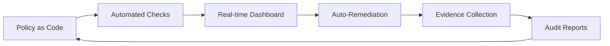

# Compliance Frameworks

## Why Compliance Matters in DevSecOps

Compliance frameworks provide structured guidance for security controls. In DevSecOps, compliance should be automated and continuous — not a once-a-year audit exercise.

```
Compliance as Code:
"Automate the verification of compliance requirements in your CI/CD pipeline"
```

## Common Compliance Frameworks

### SOC 2 (Service Organization Control 2)

**Applies to:** SaaS companies, cloud service providers

**Trust Service Criteria:**

| Criteria | Description | DevSecOps Controls |
|----------|-------------|-------------------|
| **Security** | Protect against unauthorized access | IAM, encryption, vulnerability scanning |
| **Availability** | System is available as agreed | SLAs, monitoring, DR/BCP |
| **Processing Integrity** | Complete, accurate processing | Input validation, audit logs |
| **Confidentiality** | Protect confidential information | Encryption, access controls |
| **Privacy** | Personal information handled properly | Data minimization, PII protection |

**Key Evidence for SOC 2:**

- Automated security scans with documented remediation
- Change management logs (every deployment)
- Access review records
- Incident response logs
- Vulnerability management tracking

### PCI-DSS (Payment Card Industry Data Security Standard)

**Applies to:** Organizations that handle credit card data

**12 Requirements:**

```
1.  Network controls (firewalls)
2.  Vendor defaults changed
3.  Cardholder data protection
4.  Encryption in transit
5.  Malware protection
6.  Secure systems and software (includes SAST/DAST)
7.  Restrict access by business need
8.  Authentication management
9.  Physical access restrictions
10. Logging and monitoring
11. Security testing (pen testing, vulnerability scans)
12. Information security policy
```

**Key DevSecOps Controls:**

- Vulnerability scanning (Req. 6.3.3 — patch within 1 month)
- Change management with security testing (Req. 6.5)
- Audit logging of all access (Req. 10)
- Quarterly vulnerability scans (Req. 11.3)
- Annual penetration testing (Req. 11.4)

### ISO 27001

**Applies to:** Any organization wanting a certified ISMS

**Key Domains:**

| Annex A Domain | Controls |
|----------------|----------|
| **A.8** | Asset management |
| **A.9** | Access control |
| **A.10** | Cryptography |
| **A.12** | Operations security |
| **A.14** | System acquisition, development, maintenance |
| **A.16** | Incident management |

### GDPR

**Applies to:** Any organization processing EU personal data

**Key Requirements for DevSecOps:**

- **Data protection by design** — build privacy into systems (not bolted on)
- **72-hour breach notification** — incident response must support this
- **Right to erasure** — systems must support data deletion
- **Data minimization** — collect only what's needed
- **Data processing records** — document all data flows

### NIST Cybersecurity Framework (CSF)

**Applies to:** Any organization (US-focused, widely adopted)

```
NIST CSF Core Functions:
├── IDENTIFY   → Asset management, risk assessment
├── PROTECT    → Access control, security training, data security
├── DETECT     → Anomaly detection, continuous monitoring
├── RESPOND    → Incident response, communications
└── RECOVER    → Recovery planning, improvements
```

### CIS Controls v8

18 prioritized security controls organized into implementation groups:

| IG | For | Controls |
|----|-----|----------|
| **IG1** | Small/limited resources | Inventory, basic hygiene, patching |
| **IG2** | Moderate resources | Log management, email security, vulnerability scanning |
| **IG3** | Large/complex | Pen testing, incident response, data protection |

## Compliance Mapping

Map your security controls to multiple frameworks at once:

| Control | SOC 2 | PCI-DSS | ISO 27001 | NIST CSF |
|---------|-------|---------|-----------|----------|
| Vulnerability scanning | CC7.1 | Req. 6, 11 | A.12.6 | DE.CM-8 |
| Access control | CC6.1 | Req. 7, 8 | A.9 | PR.AC |
| Incident response | CC7.3 | Req. 12.10 | A.16 | RS |
| Logging & monitoring | CC7.2 | Req. 10 | A.12.4 | DE.CM |
| Encryption | CC6.7 | Req. 3, 4 | A.10 | PR.DS |

## Continuous Compliance

Instead of annual audits, implement continuous compliance:


