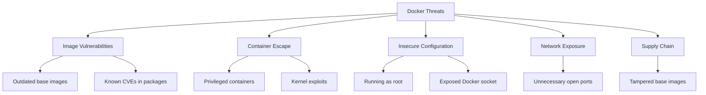

# Docker Security

## Docker Threat Model



## Secure Dockerfile Practices

### Minimal Base Images

```dockerfile
# Bad: Full OS image (hundreds of MB, large attack surface)
FROM ubuntu:22.04

# Better: Slim variant
FROM python:3.12-slim

# Best: Distroless (no shell, no package manager)
FROM gcr.io/distroless/python3-debian12

# Also good: Alpine (small but has shell)
FROM node:20-alpine
```

### Multi-Stage Builds

```dockerfile
# Build stage - has all build tools
FROM golang:1.22 AS builder
WORKDIR /app
COPY go.mod go.sum ./
RUN go mod download
COPY . .
RUN CGO_ENABLED=0 GOOS=linux go build -o /app/server

# Runtime stage - minimal image
FROM gcr.io/distroless/static-debian12
COPY --from=builder /app/server /server
USER nonroot:nonroot
ENTRYPOINT ["/server"]
```

### Non-Root User

```dockerfile
FROM node:20-alpine

# Create non-root user
RUN addgroup -S appgroup && adduser -S appuser -G appgroup

WORKDIR /app
COPY --chown=appuser:appgroup . .
RUN npm ci --only=production

# Switch to non-root user
USER appuser

EXPOSE 3000
CMD ["node", "server.js"]
```

### Pin Dependencies

```dockerfile
# Pin base image by digest
FROM node:20-alpine@sha256:abc123def456...

# Pin package versions
RUN apk add --no-cache \
    curl=8.5.0-r0 \
    openssl=3.1.4-r2

# Use lock file for application dependencies
COPY package.json package-lock.json ./
RUN npm ci
```

## Docker Daemon Security

### Daemon Configuration

```json
// /etc/docker/daemon.json
{
  "icc": false,
  "log-driver": "json-file",
  "log-opts": {
    "max-size": "10m",
    "max-file": "3"
  },
  "no-new-privileges": true,
  "userns-remap": "default",
  "live-restore": true,
  "storage-driver": "overlay2"
}
```

### Socket Protection

```bash
# Never expose Docker socket to containers
# Bad:
docker run -v /var/run/docker.sock:/var/run/docker.sock myapp

# If you must (e.g., CI), use read-only and limited access
docker run -v /var/run/docker.sock:/var/run/docker.sock:ro \
  --security-opt no-new-privileges myapp
```

## Container Runtime Security

### Security Options

```bash
docker run \
  --read-only \                     # Read-only filesystem
  --tmpfs /tmp \                    # Writable tmp only
  --cap-drop ALL \                  # Drop all capabilities
  --cap-add NET_BIND_SERVICE \      # Add only what's needed
  --security-opt no-new-privileges \# Prevent privilege escalation
  --security-opt seccomp=profile.json \  # Seccomp profile
  --pids-limit 100 \               # Limit processes
  --memory 256m \                   # Memory limit
  --cpus 0.5 \                      # CPU limit
  --network custom-net \            # Custom network
  myapp:v1.0.0
```

### Linux Capabilities

```
Dangerous Capabilities (never use unless required):
├── SYS_ADMIN      - Mount filesystems, manage namespaces
├── NET_ADMIN      - Configure networking
├── SYS_PTRACE     - Debug other processes
├── DAC_OVERRIDE   - Bypass file permission checks
└── SYS_RAWIO      - Raw I/O access

Safe Minimal Capabilities:
├── NET_BIND_SERVICE  - Bind to low ports
├── CHOWN             - Change file ownership
└── SETUID/SETGID     - Set user/group IDs
```

## Docker Compose Security

```yaml
# docker-compose.yml with security settings
services:
  app:
    image: myapp:v1.0.0
    read_only: true
    tmpfs:
      - /tmp
    security_opt:
      - no-new-privileges:true
    cap_drop:
      - ALL
    cap_add:
      - NET_BIND_SERVICE
    deploy:
      resources:
        limits:
          memory: 256M
          cpus: '0.50'
    networks:
      - app-network
    healthcheck:
      test: ["CMD", "curl", "-f", "http://localhost:3000/health"]
      interval: 30s
      timeout: 10s
      retries: 3

  db:
    image: postgres:16-alpine
    read_only: true
    tmpfs:
      - /tmp
      - /run/postgresql
    volumes:
      - db-data:/var/lib/postgresql/data
    networks:
      - db-network  # Isolated from app-network
    environment:
      POSTGRES_PASSWORD_FILE: /run/secrets/db_password
    secrets:
      - db_password

networks:
  app-network:
    internal: false
  db-network:
    internal: true  # No external access

secrets:
  db_password:
    file: ./secrets/db_password.txt

volumes:
  db-data:
```

## Dockerfile Linting

```bash
# Hadolint - Dockerfile linter
hadolint Dockerfile

# Common rules:
# DL3007 - Using latest is prone to errors
# DL3008 - Pin versions in apt-get install
# DL3009 - Delete apt-get lists after install
# DL3018 - Pin versions in apk add
# DL3025 - Use JSON notation for CMD
# DL4006 - Set SHELL option -o pipefail
```

## Docker Security Scanning Tools

| Tool | Purpose | Integration |
|------|---------|-------------|
| **Trivy** | Image vulnerability scanning | CI/CD, CLI |
| **Grype** | Image vulnerability scanning | CI/CD, CLI |
| **Hadolint** | Dockerfile linting | Pre-commit, CI/CD |
| **Dockle** | Container image linting | CI/CD |
| **Docker Scout** | Docker-native scanning | Docker CLI |
| **Falco** | Runtime threat detection | Kubernetes, Docker |
