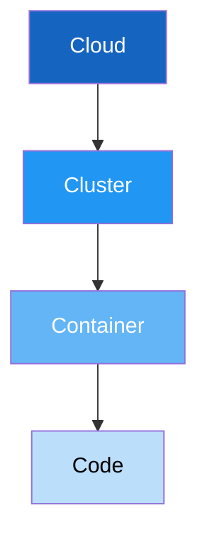

# Kubernetes Security

## The 4C's of Cloud-Native Security



Security must be addressed at every layer — a vulnerability at any layer compromises the layers inside it.

## Cluster Security

### API Server Hardening

```yaml
# Key API server flags
--anonymous-auth=false               # Disable anonymous access
--authorization-mode=RBAC,Node       # Enable RBAC
--enable-admission-plugins=NodeRestriction,PodSecurity
--audit-log-path=/var/log/kubernetes/audit.log
--audit-log-maxage=30
--audit-log-maxbackup=10
--encryption-provider-config=/etc/kubernetes/encryption.yaml
--tls-min-version=VersionTLS12
```

### RBAC (Role-Based Access Control)

```yaml
# Principle of least privilege
apiVersion: rbac.authorization.k8s.io/v1
kind: Role
metadata:
  name: pod-reader
  namespace: app-namespace
rules:
  - apiGroups: [""]
    resources: ["pods"]
    verbs: ["get", "list", "watch"]  # Read-only
---
apiVersion: rbac.authorization.k8s.io/v1
kind: RoleBinding
metadata:
  name: read-pods
  namespace: app-namespace
subjects:
  - kind: ServiceAccount
    name: app-service-account
    namespace: app-namespace
roleRef:
  kind: Role
  name: pod-reader
  apiGroup: rbac.authorization.k8s.io
```

### Network Policies

```yaml
# Default deny all ingress and egress
apiVersion: networking.k8s.io/v1
kind: NetworkPolicy
metadata:
  name: default-deny-all
  namespace: app-namespace
spec:
  podSelector: {}
  policyTypes:
    - Ingress
    - Egress
---
# Allow specific traffic
apiVersion: networking.k8s.io/v1
kind: NetworkPolicy
metadata:
  name: allow-app-to-db
  namespace: app-namespace
spec:
  podSelector:
    matchLabels:
      app: database
  policyTypes:
    - Ingress
  ingress:
    - from:
        - podSelector:
            matchLabels:
              app: backend
      ports:
        - protocol: TCP
          port: 5432
```

## Pod Security

### Pod Security Standards

Kubernetes provides three built-in security profiles:

| Profile | Description |
|---------|-------------|
| **Privileged** | Unrestricted (for system workloads) |
| **Baseline** | Prevents known privilege escalations |
| **Restricted** | Heavily restricted, best practices |

```yaml
# Enforce restricted profile on namespace
apiVersion: v1
kind: Namespace
metadata:
  name: secure-app
  labels:
    pod-security.kubernetes.io/enforce: restricted
    pod-security.kubernetes.io/audit: restricted
    pod-security.kubernetes.io/warn: restricted
```

### Secure Pod Specification

```yaml
apiVersion: v1
kind: Pod
metadata:
  name: secure-app
spec:
  automountServiceAccountToken: false  # Don't mount SA token
  securityContext:
    runAsNonRoot: true
    runAsUser: 1000
    runAsGroup: 1000
    fsGroup: 1000
    seccompProfile:
      type: RuntimeDefault
  containers:
    - name: app
      image: myapp:v1.0.0@sha256:abc123...  # Pin by digest
      securityContext:
        allowPrivilegeEscalation: false
        readOnlyRootFilesystem: true
        capabilities:
          drop: ["ALL"]
      resources:
        limits:
          memory: "256Mi"
          cpu: "500m"
        requests:
          memory: "128Mi"
          cpu: "250m"
      volumeMounts:
        - name: tmp
          mountPath: /tmp
  volumes:
    - name: tmp
      emptyDir:
        sizeLimit: 100Mi
```

## Secrets Management in Kubernetes

### Encrypted Secrets at Rest

```yaml
# /etc/kubernetes/encryption.yaml
apiVersion: apiserver.config.k8s.io/v1
kind: EncryptionConfiguration
resources:
  - resources:
      - secrets
    providers:
      - aescbc:
          keys:
            - name: key1
              secret: <base64-encoded-key>
      - identity: {}
```

### External Secrets Operator

```yaml
# Sync secrets from AWS Secrets Manager
apiVersion: external-secrets.io/v1beta1
kind: ExternalSecret
metadata:
  name: app-secrets
spec:
  refreshInterval: 1h
  secretStoreRef:
    name: aws-secretsmanager
    kind: ClusterSecretStore
  target:
    name: app-secrets
  data:
    - secretKey: db-password
      remoteRef:
        key: prod/app/database
        property: password
```

## Security Scanning Tools

| Tool | Purpose |
|------|---------|
| **kube-bench** | CIS Benchmark compliance |
| **kube-hunter** | Penetration testing for clusters |
| **Kubescape** | Kubernetes security posture |
| **Falco** | Runtime threat detection |
| **Kyverno** | Policy enforcement |
| **OPA/Gatekeeper** | Admission control policies |
| **Trivy** | Image + IaC + K8s scanning |

### Running kube-bench

```bash
# Run CIS benchmark check
kubectl apply -f https://raw.githubusercontent.com/aquasecurity/kube-bench/main/job.yaml

# View results
kubectl logs job/kube-bench
```

## Kubernetes Security Checklist

- [ ] RBAC enabled with least-privilege roles
- [ ] Network policies enforced (default deny)
- [ ] Pod Security Standards enforced (restricted)
- [ ] Secrets encrypted at rest
- [ ] API server audit logging enabled
- [ ] Container images pinned by digest
- [ ] Resource limits set on all containers
- [ ] Service account tokens not auto-mounted
- [ ] Runtime security monitoring (Falco)
- [ ] Regular CIS benchmark scans
