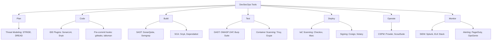

# DevSecOps Overview

## What is DevSecOps?

DevSecOps stands for **Development, Security, and Operations**. It is an evolution of DevOps that integrates security practices within the DevOps process. The goal is to build security into every part of the IT lifecycle — from initial design through integration, testing, deployment, and software delivery.

## DevOps vs DevSecOps

| Aspect | DevOps | DevSecOps |
|--------|--------|-----------|
| **Focus** | Speed and collaboration | Speed, collaboration, and security |
| **Security** | Added at the end | Integrated throughout |
| **Responsibility** | Dev + Ops | Dev + Sec + Ops (shared) |
| **Testing** | Functional + Performance | Functional + Performance + Security |
| **Tooling** | CI/CD, monitoring | CI/CD, monitoring + security scanning |

## Core Pillars of DevSecOps

### 1. Shift Left Security
Move security testing and practices earlier in the development lifecycle rather than at the end.

**Benefits of shifting left:**

- Cheaper to fix vulnerabilities early
- Faster feedback loops for developers
- Reduced time-to-market with security built in
- Less friction between security and development teams

### 2. Automation
Automate security checks to keep pace with rapid development cycles.

- **Static Application Security Testing (SAST)** in CI pipelines
- **Dynamic Application Security Testing (DAST)** in staging environments
- **Software Composition Analysis (SCA)** for dependency scanning
- **Infrastructure as Code (IaC)** scanning for misconfigurations
- **Container image scanning** before deployment

### 3. Continuous Monitoring
Security doesn't end at deployment — continuously monitor production environments.

- Runtime Application Self-Protection (RASP)
- Security Information and Event Management (SIEM)
- Intrusion Detection Systems (IDS/IPS)
- Cloud Security Posture Management (CSPM)

### 4. Collaboration and Shared Responsibility
Break down silos between development, security, and operations teams.

- Security champions within development teams
- Shared KPIs and metrics
- Cross-functional training and knowledge sharing
- Blameless post-mortems

## The DevSecOps Maturity Model

### Level 1: Initial
- Security is reactive and ad-hoc
- No automated security testing
- Security team is a bottleneck

### Level 2: Managed
- Basic security tools integrated into CI/CD
- Some automated scanning (SAST/SCA)
- Security requirements documented

### Level 3: Defined
- Security gates at key pipeline stages
- Threat modeling practiced regularly
- Security training for developers

### Level 4: Measured
- Security metrics tracked and reported
- Continuous compliance monitoring
- Automated remediation for common issues

### Level 5: Optimized
- Security fully embedded in culture
- AI/ML-driven threat detection
- Proactive security research and red teaming

## Key Metrics

| Metric | Description | Target |
|--------|-------------|--------|
| **MTTD** | Mean Time to Detect vulnerabilities | < 24 hours |
| **MTTR** | Mean Time to Remediate | < 72 hours |
| **Vulnerability Escape Rate** | Vulns reaching production | < 5% |
| **Security Debt** | Outstanding security issues | Trending down |
| **Patch Compliance** | Systems with current patches | > 95% |
| **Scan Coverage** | Code/infra scanned automatically | > 90% |

## Tools Landscape

