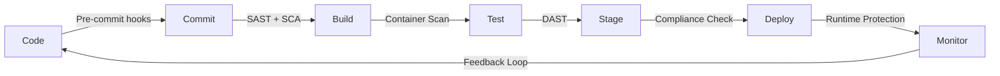

# DevSecOps Pipeline

## The Secure Software Development Lifecycle

A DevSecOps pipeline integrates security checks at every stage of the CI/CD process, ensuring vulnerabilities are caught early and automatically.



## Pipeline Stages & Security Controls

### 1. Pre-Commit Phase

Security checks that run before code is committed to the repository.

**Tools & Practices:**

| Tool | Purpose |
|------|---------|
| **gitleaks** | Detect secrets in code |
| **talisman** | Pre-commit hook for secret detection |
| **pre-commit framework** | Manage and run pre-commit hooks |
| **IDE security plugins** | Real-time security feedback |

**Example pre-commit configuration:**

```yaml
# .pre-commit-config.yaml
repos:
  - repo: https://github.com/gitleaks/gitleaks
    rev: v8.18.0
    hooks:
      - id: gitleaks

  - repo: https://github.com/pre-commit/pre-commit-hooks
    rev: v4.5.0
    hooks:
      - id: detect-private-key
      - id: check-added-large-files
        args: ['--maxkb=500']

  - repo: https://github.com/hadolint/hadolint
    rev: v2.12.0
    hooks:
      - id: hadolint
```

### 2. Commit & Build Phase

Security scanning during the build process.

**Static Application Security Testing (SAST):**

```yaml
# Example: SonarQube in GitHub Actions
- name: SonarQube Scan
  uses: SonarSource/sonarqube-scan-action@v2
  env:
    SONAR_TOKEN: ${{ secrets.SONAR_TOKEN }}
    SONAR_HOST_URL: ${{ secrets.SONAR_HOST_URL }}
```

**Software Composition Analysis (SCA):**

```yaml
# Example: Snyk dependency scanning
- name: Snyk Security Check
  uses: snyk/actions/node@master
  env:
    SNYK_TOKEN: ${{ secrets.SNYK_TOKEN }}
  with:
    command: test
    args: --severity-threshold=high
```

### 3. Test Phase

Automated security testing in test environments.

**Dynamic Application Security Testing (DAST):**

```yaml
# Example: OWASP ZAP scan
- name: OWASP ZAP Scan
  uses: zaproxy/action-full-scan@v0.9.0
  with:
    target: 'https://staging.example.com'
    rules_file_name: '.zap/rules.tsv'
    cmd_options: '-a'
```

**Container Security Scanning:**

```yaml
# Example: Trivy container scan
- name: Trivy Container Scan
  uses: aquasecurity/trivy-action@master
  with:
    image-ref: 'myapp:${{ github.sha }}'
    format: 'sarif'
    output: 'trivy-results.sarif'
    severity: 'CRITICAL,HIGH'
```

### 4. Staging & Pre-Production

Final security validation before production deployment.

**Infrastructure as Code Scanning:**

```yaml
# Example: Checkov IaC scan
- name: Checkov IaC Scan
  uses: bridgecrewio/checkov-action@master
  with:
    directory: ./terraform
    framework: terraform
    soft_fail: false
```

**Compliance as Code:**

```yaml
# Example: OPA policy check
- name: OPA Policy Check
  run: |
    opa eval --data policies/ --input deploy-config.json \
      "data.deployment.allow"
```

### 5. Production & Monitoring

Runtime security and continuous monitoring.

- **Web Application Firewall (WAF)** — Filter malicious traffic
- **Runtime Application Self-Protection (RASP)** — In-app security monitoring
- **SIEM Integration** — Centralized log analysis
- **Alerting** — Automated incident notification

## Complete Pipeline Example

```yaml
# .github/workflows/devsecops-pipeline.yml
name: DevSecOps Pipeline

on:
  push:
    branches: [main]
  pull_request:
    branches: [main]

jobs:
  secret-scan:
    runs-on: ubuntu-latest
    steps:
      - uses: actions/checkout@v4
        with:
          fetch-depth: 0
      - uses: gitleaks/gitleaks-action@v2
        env:
          GITHUB_TOKEN: ${{ secrets.GITHUB_TOKEN }}

  sast:
    runs-on: ubuntu-latest
    needs: secret-scan
    steps:
      - uses: actions/checkout@v4
      - name: Run Semgrep
        uses: returntocorp/semgrep-action@v1
        with:
          config: >-
            p/security-audit
            p/secrets
            p/owasp-top-ten

  sca:
    runs-on: ubuntu-latest
    needs: secret-scan
    steps:
      - uses: actions/checkout@v4
      - name: Dependency Check
        uses: snyk/actions/node@master
        env:
          SNYK_TOKEN: ${{ secrets.SNYK_TOKEN }}

  container-scan:
    runs-on: ubuntu-latest
    needs: [sast, sca]
    steps:
      - uses: actions/checkout@v4
      - name: Build Image
        run: docker build -t myapp:${{ github.sha }} .
      - name: Scan with Trivy
        uses: aquasecurity/trivy-action@master
        with:
          image-ref: 'myapp:${{ github.sha }}'
          severity: 'CRITICAL,HIGH'
          exit-code: '1'

  dast:
    runs-on: ubuntu-latest
    needs: container-scan
    steps:
      - name: DAST Scan
        uses: zaproxy/action-baseline@v0.9.0
        with:
          target: 'https://staging.example.com'

  deploy:
    runs-on: ubuntu-latest
    needs: [dast]
    if: github.ref == 'refs/heads/main'
    steps:
      - uses: actions/checkout@v4
      - name: Deploy to Production
        run: echo "Deploy with security gates passed"
```

## Pipeline Security Gates

Define clear pass/fail criteria for each security stage:

| Stage | Gate Criteria | Action on Failure |
|-------|---------------|-------------------|
| Secret Scan | Zero secrets detected | Block commit |
| SAST | No critical/high findings | Block merge |
| SCA | No critical CVEs, no licenses violations | Block build |
| Container Scan | No critical vulnerabilities | Block deployment |
| DAST | No critical findings | Block release |
| IaC Scan | No misconfigurations | Block provisioning |
| Compliance | All policies passing | Block deployment |

## Pipeline Metrics Dashboard

Track these metrics to measure pipeline effectiveness:

- **Pipeline pass rate** — % of builds passing all security gates
- **Mean time to remediate** — Average time from detection to fix
- **False positive rate** — % of findings that are not actionable
- **Security scan duration** — Time added by security stages
- **Vulnerability trend** — New vs. resolved vulnerabilities over time
