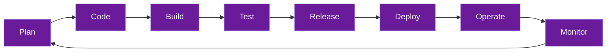

# DevSecOps Study Notes

Welcome to the **DevSecOps Study Notes** — a comprehensive knowledge base covering the principles, tools, and practices of integrating security into every stage of the software development lifecycle.

## What is DevSecOps?

DevSecOps is the practice of integrating security at every phase of the software development lifecycle — from initial design through integration, testing, deployment, and delivery. Rather than treating security as an afterthought or a gate at the end, DevSecOps makes security a **shared responsibility** across development, security, and operations teams.

## How This Documentation is Organized

| Section | Description |
|---------|-------------|
| **DevSecOps Fundamentals** | Core concepts, culture, and pipeline overview |
| **Version Control Security** | Git security, secrets management, branch policies |
| **CI/CD Security** | Securing pipelines, GitHub Actions, hardening |
| **Container Security** | Docker, Kubernetes, image scanning |
| **Infrastructure as Code** | Terraform, Ansible, IaC scanning |
| **Application Security** | SAST, DAST, SCA, OWASP Top 10 |
| **Cloud Security** | AWS, Azure, Cloud Security Posture Management |
| **Monitoring & Incident Response** | SIEM, logging, incident response playbooks |
| **Compliance & Governance** | Frameworks, policy as code, audit trails |

## Key Principles

> **"Security is not a phase — it's a practice woven into every step."**

## Getting Started

Start with the [DevSecOps Overview](devsecops/overview.md) to understand the foundational concepts, then explore each section based on your learning goals.
