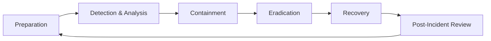

# Incident Response

## Incident Response Lifecycle



## Preparation

### Incident Response Plan

Every organization needs a documented IR plan that includes:

- **Roles and responsibilities** — who does what during an incident
- **Communication plan** — internal and external notification procedures
- **Escalation procedures** — when and how to escalate
- **Tool inventory** — forensic tools, communication channels
- **Runbooks** — step-by-step procedures for common incidents

### Incident Response Team Roles

| Role | Responsibility |
|------|---------------|
| **Incident Commander** | Overall coordination, decisions, communication |
| **Technical Lead** | Technical investigation and remediation |
| **Communications Lead** | Internal/external communications |
| **Scribe** | Document all actions, findings, timeline |
| **Subject Matter Experts** | Provide domain expertise as needed |

## Incident Classification

### Severity Levels

| Severity | Description | Response Time | Examples |
|----------|-------------|---------------|---------|
| **SEV-1** | Critical business impact | 15 min | Active data breach, ransomware |
| **SEV-2** | Significant impact | 1 hour | Credential compromise, system compromise |
| **SEV-3** | Limited impact | 4 hours | Malware on single host, phishing success |
| **SEV-4** | Minimal impact | Next business day | Policy violation, suspicious activity |

## Detection & Analysis

### Initial Triage Checklist

```markdown
## Incident Triage

### What happened?
- [ ] Alert source and type
- [ ] Affected systems/users
- [ ] Initial timeline (when did it start?)

### What is the scope?
- [ ] Number of affected systems
- [ ] Data types potentially exposed
- [ ] Business impact assessment

### Is it ongoing?
- [ ] Is the attacker still active?
- [ ] Is data still being exfiltrated?
- [ ] Are more systems being compromised?

### Evidence collection
- [ ] Preserve logs (do NOT delete or modify)
- [ ] Screenshot active sessions
- [ ] Note all IP addresses, usernames, file hashes
- [ ] Document the chain of events
```

### Evidence Collection

```bash
# Capture volatile data first (order of volatility)
# 1. Memory
sudo dd if=/dev/mem of=/evidence/memory.dump

# 2. Network connections
ss -tunap > /evidence/network_connections.txt
ip addr > /evidence/network_config.txt

# 3. Running processes
ps auxf > /evidence/processes.txt
lsof -i > /evidence/open_files.txt

# 4. User sessions
who > /evidence/active_users.txt
last > /evidence/login_history.txt

# 5. System logs
cp -r /var/log /evidence/logs/

# 6. File system timeline
find / -newer /tmp/reference_timestamp -ls > /evidence/recent_files.txt
```

## Containment

### Short-Term Containment

Immediate actions to stop the bleeding:

```bash
# Isolate compromised host (network)
iptables -I INPUT -j DROP
iptables -I OUTPUT -j DROP
# Or disconnect from network (keep powered on for forensics)

# Block malicious IP at firewall
aws ec2 revoke-security-group-ingress \
  --group-id sg-xxx \
  --protocol tcp \
  --port 0-65535 \
  --cidr MALICIOUS_IP/32

# Disable compromised account
aws iam update-login-profile --user-name compromised-user --no-password-reset-required
aws iam delete-access-key --user-name compromised-user --access-key-id AKIA...

# Rotate exposed secrets
aws secretsmanager rotate-secret --secret-id compromised-secret
```

### Long-Term Containment

- Patch the vulnerability that was exploited
- Implement additional monitoring
- Apply temporary compensating controls
- Prepare clean systems for recovery

## Eradication

- Remove malware and backdoors
- Patch all affected systems
- Reset compromised credentials
- Review and close attack vectors
- Verify eradication with scanning

## Recovery

```markdown
## Recovery Checklist

- [ ] Restore from known-good backups
- [ ] Verify system integrity
- [ ] Monitor restored systems closely (48-72 hours)
- [ ] Gradually restore services
- [ ] Confirm normal operations
- [ ] Validate security controls are functioning
```

## Post-Incident Review

### Blameless Post-Mortem Template

```markdown
# Incident Post-Mortem: [Incident Title]

**Date:** YYYY-MM-DD
**Severity:** SEV-X
**Duration:** X hours
**Author:** [Name]
**Attendees:** [Team members]

## Summary
[2-3 sentence description of the incident]

## Timeline
| Time (UTC) | Event |
|------------|-------|
| HH:MM | Initial alert triggered |
| HH:MM | Incident commander assigned |
| HH:MM | Root cause identified |
| HH:MM | Containment actions taken |
| HH:MM | Incident resolved |

## Root Cause
[Detailed explanation of why the incident occurred]

## Impact
- Users affected: X
- Data exposed: [type and scope]
- Business impact: [revenue, reputation, etc.]
- Duration of impact: X hours

## What Went Well
- [List things that worked during response]

## What Could Be Improved
- [List areas for improvement]

## Action Items
| Action | Owner | Due Date | Status |
|--------|-------|----------|--------|
| [Fix root cause] | @engineer | YYYY-MM-DD | Open |
| [Add detection rule] | @security | YYYY-MM-DD | Open |
| [Update runbook] | @oncall | YYYY-MM-DD | Open |

## Lessons Learned
[Key takeaways for the organization]
```

## Common Incident Playbooks

### Compromised Credentials

1. Disable the compromised account
2. Revoke all active sessions and tokens
3. Reset password and MFA
4. Review account activity logs
5. Check for persistence mechanisms
6. Notify affected users
7. Determine how credentials were compromised

### Ransomware

1. Isolate affected systems immediately
2. Do NOT pay the ransom
3. Preserve evidence
4. Identify the ransomware variant
5. Check for available decryptors
6. Restore from offline backups
7. Report to law enforcement

### Data Breach

1. Contain the breach
2. Assess scope and data types exposed
3. Preserve evidence for forensics
4. Notify legal and compliance teams
5. Determine notification obligations (GDPR: 72 hours)
6. Prepare customer notification
7. Engage external forensics if needed
