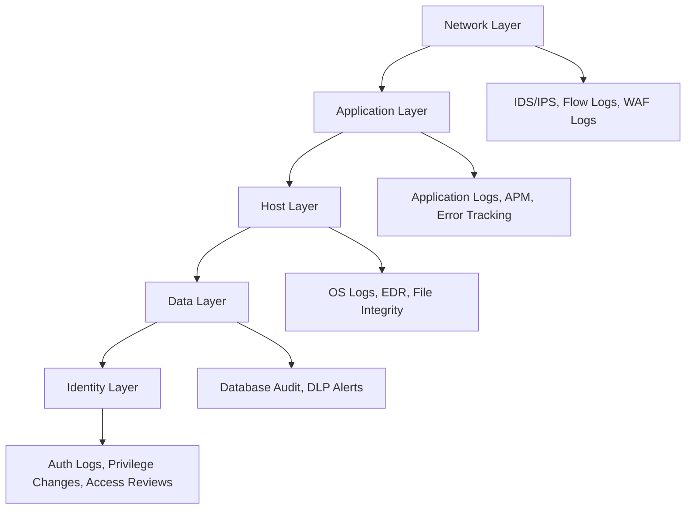

# Security Monitoring

## Why Security Monitoring?

Detection is the complement of prevention. No matter how well you secure your systems, you need continuous monitoring to detect attacks that bypass preventive controls.

```
Average Time to Detect a Breach: 204 days (IBM Cost of Data Breach 2023)
Average Time to Contain: 73 days
Average Cost: $4.45 million
```

## Monitoring Strategy

### Defense in Depth Monitoring



## Key Security Events to Monitor

### Authentication & Authorization

| Event | Severity | Action |
|-------|----------|--------|
| Multiple failed logins | Medium | Alert after 5 failures |
| Login from new location/device | Low | Log, notify user |
| Privilege escalation | High | Alert immediately |
| Service account usage anomaly | High | Alert immediately |
| Disabled MFA | Critical | Alert + auto-re-enable |
| Admin actions outside business hours | Medium | Alert for review |

### Network Events

| Event | Severity | Action |
|-------|----------|--------|
| Unusual outbound traffic | High | Alert, investigate |
| Connection to known malicious IP | Critical | Block + alert |
| Port scanning detected | Medium | Alert |
| DNS queries to suspicious domains | High | Alert, investigate |
| Lateral movement patterns | Critical | Alert + isolate |

### Application Events

| Event | Severity | Action |
|-------|----------|--------|
| SQL injection attempts | High | Alert + WAF block |
| XSS attempts | Medium | Alert + WAF block |
| File upload of suspicious types | Medium | Alert, quarantine |
| API rate limit exceeded | Low | Log, monitor |
| Unauthorized API access | High | Alert immediately |

## Log Collection Architecture

```
Sources:
├── Cloud (CloudTrail, Azure Monitor, GCP Audit)
├── Network (VPC Flow Logs, Firewall, WAF)
├── Application (Structured JSON logs)
├── Host (syslog, Windows Events)
├── Container (stdout/stderr, Falco)
└── Identity (IdP logs, MFA events)
    │
    ▼
Log Aggregation (Fluentd/Vector/Filebeat)
    │
    ▼
SIEM / Log Platform
├── Real-time Correlation
├── Alerting Rules
├── Dashboards
└── Retention (Hot: 30d, Warm: 90d, Cold: 1yr+)
```

## Structured Security Logging

```python
import structlog
import json

logger = structlog.get_logger("security")

# Good: Structured, contextual security log
logger.warning("authentication_failed",
    event_type="auth_failure",
    username=username,
    source_ip=request.remote_addr,
    user_agent=request.user_agent.string,
    failure_reason="invalid_password",
    attempt_count=get_attempt_count(username),
    timestamp=datetime.utcnow().isoformat()
)

# Good: Structured authorization log
logger.critical("authorization_violation",
    event_type="authz_violation",
    user_id=current_user.id,
    requested_resource=f"/api/admin/users",
    required_role="admin",
    actual_role=current_user.role,
    source_ip=request.remote_addr
)
```

## Alerting Best Practices

### Alert Severity Levels

| Level | Response Time | Example |
|-------|---------------|---------|
| **P1 - Critical** | 15 minutes | Active breach, data exfiltration |
| **P2 - High** | 1 hour | Credential compromise, privilege escalation |
| **P3 - Medium** | 4 hours | Suspicious activity, policy violation |
| **P4 - Low** | Next business day | Informational, trending anomaly |

### Reducing Alert Fatigue

1. **Tune thresholds** — adjust to reduce false positives
2. **Correlate events** — one alert for related events, not 100
3. **Context enrichment** — add user, asset, and threat intelligence
4. **Prioritize by asset value** — critical assets get higher priority
5. **Automate triage** — SOAR for common scenarios
6. **Regular review** — retire noisy, low-value alerts

## Detection Engineering

### Sigma Rules

Sigma is a generic signature format for SIEM rules:

```yaml
# Detect brute force attack
title: Brute Force Login Attempt
status: stable
description: Detects multiple failed login attempts from a single source
logsource:
  category: authentication
  product: linux
detection:
  selection:
    EventType: "authentication_failure"
  condition: selection | count(source_ip) by username > 10
  timeframe: 5m
level: medium
tags:
  - attack.credential_access
  - attack.t1110
```

## Monitoring Tools

| Tool | Type | Use Case |
|------|------|----------|
| **Splunk** | SIEM | Enterprise log analysis |
| **Elastic Security** | SIEM | Open-source SIEM |
| **Grafana + Loki** | Log aggregation | Cost-effective logging |
| **Prometheus + Alertmanager** | Metrics | Infrastructure monitoring |
| **Falco** | Runtime | Container/K8s threat detection |
| **OSSEC/Wazuh** | HIDS | Host-based intrusion detection |
| **Suricata** | NIDS | Network intrusion detection |
