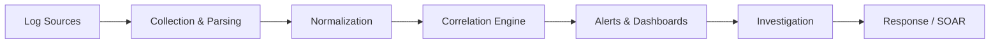

# SIEM & Log Management

## What is SIEM?

**Security Information and Event Management (SIEM)** collects, correlates, and analyzes security events from across your infrastructure to detect threats and support incident response.



## SIEM Architecture

### ELK Stack (Elasticsearch, Logstash, Kibana)

```yaml
# docker-compose.yml for ELK
services:
  elasticsearch:
    image: docker.elastic.co/elasticsearch/elasticsearch:8.12.0
    environment:
      - discovery.type=single-node
      - xpack.security.enabled=true
      - ELASTIC_PASSWORD=${ELASTIC_PASSWORD}
    volumes:
      - es-data:/usr/share/elasticsearch/data

  logstash:
    image: docker.elastic.co/logstash/logstash:8.12.0
    volumes:
      - ./logstash/pipeline:/usr/share/logstash/pipeline

  kibana:
    image: docker.elastic.co/kibana/kibana:8.12.0
    environment:
      - ELASTICSEARCH_HOSTS=http://elasticsearch:9200
    ports:
      - "5601:5601"
```

### Logstash Pipeline for Security

```ruby
# logstash/pipeline/security.conf
input {
  beats { port => 5044 }
  syslog { port => 5514 }
}

filter {
  # Parse JSON logs
  if [type] == "application" {
    json { source => "message" }
  }

  # Enrich with GeoIP
  if [source_ip] {
    geoip { source => "source_ip" }
  }

  # Tag security events
  if [event_type] in ["auth_failure", "authz_violation", "privilege_escalation"] {
    mutate { add_tag => ["security_event"] }
  }

  # Detect brute force (5+ failures in 5 minutes)
  if [event_type] == "auth_failure" {
    throttle {
      key => "%{source_ip}"
      period => 300
      after_count => 5
      add_tag => "brute_force_detected"
    }
  }
}

output {
  elasticsearch {
    hosts => ["elasticsearch:9200"]
    index => "security-%{+YYYY.MM.dd}"
  }

  if "brute_force_detected" in [tags] {
    email {
      to => "security-team@example.com"
      subject => "Brute Force Alert: %{source_ip}"
    }
  }
}
```

## Log Retention Strategy

| Log Type | Hot (Fast Query) | Warm (Slower) | Cold (Archive) |
|----------|------------------|---------------|----------------|
| Security events | 30 days | 90 days | 1 year |
| Authentication | 30 days | 180 days | 2 years |
| Network flow | 14 days | 60 days | 1 year |
| Application | 14 days | 30 days | 90 days |
| Compliance | 30 days | 365 days | 7 years |

## SIEM Use Cases (Detection Rules)

### Credential-Based Attacks

```yaml
# Impossible travel detection
rule:
  name: "Impossible Travel Alert"
  description: "User authenticated from two distant locations within a short time"
  query: |
    SELECT username, source_ip, geo_country, timestamp
    FROM auth_logs
    WHERE event_type = 'login_success'
    GROUP BY username
    HAVING COUNT(DISTINCT geo_country) > 1
    AND MAX(timestamp) - MIN(timestamp) < INTERVAL '2 hours'
  severity: high
  mitre_attack: T1078
```

### Data Exfiltration

```yaml
# Large data transfer detection
rule:
  name: "Unusual Data Transfer"
  description: "Abnormally large outbound data transfer"
  query: |
    SELECT source_ip, SUM(bytes_out) as total_bytes
    FROM network_logs
    WHERE direction = 'outbound'
    AND timestamp > NOW() - INTERVAL '1 hour'
    GROUP BY source_ip
    HAVING total_bytes > 1073741824  -- 1 GB
  severity: high
  mitre_attack: T1048
```

## SOAR Integration

**Security Orchestration, Automation, and Response (SOAR)** automates incident response workflows.

```yaml
# Example SOAR playbook
name: "Brute Force Response"
trigger:
  alert: "brute_force_detected"

steps:
  - name: "Enrich IP"
    action: threat_intelligence_lookup
    input:
      ip: "{{ alert.source_ip }}"

  - name: "Check if known IP"
    condition: "{{ enrichment.reputation == 'malicious' }}"
    action: block_ip
    input:
      ip: "{{ alert.source_ip }}"
      firewall: "perimeter-fw"

  - name: "Lock affected account"
    condition: "{{ alert.attempt_count > 20 }}"
    action: disable_user
    input:
      username: "{{ alert.username }}"

  - name: "Create ticket"
    action: create_incident
    input:
      title: "Brute Force: {{ alert.source_ip }} → {{ alert.username }}"
      severity: "{{ alert.severity }}"
      assignee: "security-on-call"

  - name: "Notify team"
    action: send_slack_message
    input:
      channel: "#security-alerts"
      message: "Brute force detected from {{ alert.source_ip }}"
```

## SIEM Best Practices

1. **Normalize data** — consistent field names across all sources
2. **Enrich events** — add context (GeoIP, threat intel, asset info)
3. **Tune rules** — reduce false positives to maintain analyst trust
4. **Automate response** — use SOAR for common scenarios
5. **Test detections** — use adversary simulation (Atomic Red Team)
6. **Track metrics** — MTTD, MTTR, alert-to-incident ratio
