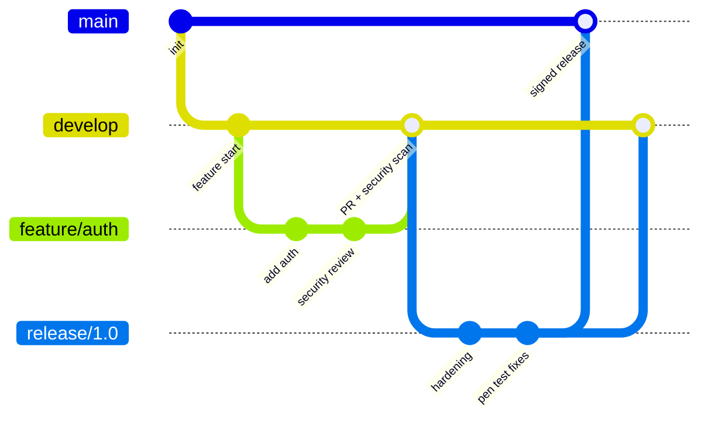

# Branch Protection & Policies

## Why Branch Protection?

Branch protection rules prevent unauthorized or accidental changes to critical branches, enforce code review, and ensure quality gates pass before merging.

## GitHub Branch Protection Rules

### Essential Settings

```
Recommended Protection Rules for 'main':
├── ✅ Require pull request reviews before merging
│   ├── Required approving reviews: 2
│   ├── Dismiss stale reviews on new pushes
│   └── Require review from code owners
├── ✅ Require status checks to pass
│   ├── SAST scan
│   ├── Unit tests
│   ├── Integration tests
│   ├── Secret detection
│   └── Dependency check
├── ✅ Require signed commits
├── ✅ Require linear history
├── ✅ Include administrators
├── ✅ Restrict force pushes
├── ✅ Restrict deletions
└── ✅ Require deployments to succeed
```

### Configuring via GitHub API

```bash
# Set branch protection rules using GitHub CLI
gh api repos/{owner}/{repo}/branches/main/protection \
  --method PUT \
  --field required_status_checks='{"strict":true,"contexts":["ci/tests","security/sast","security/sca"]}' \
  --field enforce_admins=true \
  --field required_pull_request_reviews='{"required_approving_review_count":2,"dismiss_stale_reviews":true,"require_code_owner_reviews":true}' \
  --field restrictions=null \
  --field required_linear_history=true \
  --field allow_force_pushes=false \
  --field allow_deletions=false
```

### GitHub Rulesets (Modern Approach)

GitHub Rulesets provide more flexible branch protection:

```json
{
  "name": "Production Protection",
  "target": "branch",
  "enforcement": "active",
  "conditions": {
    "ref_name": {
      "include": ["refs/heads/main", "refs/heads/release/*"],
      "exclude": []
    }
  },
  "rules": [
    { "type": "pull_request",
      "parameters": {
        "required_approving_review_count": 2,
        "dismiss_stale_reviews_on_push": true,
        "require_code_owner_review": true
      }
    },
    { "type": "required_status_checks",
      "parameters": {
        "required_status_checks": [
          { "context": "security/sast" },
          { "context": "security/secrets" },
          { "context": "ci/tests" }
        ],
        "strict_required_status_checks_policy": true
      }
    },
    { "type": "commit_message_pattern",
      "parameters": {
        "pattern": "^(feat|fix|docs|chore|refactor|test|ci)\\(.+\\): .+",
        "operator": "regex"
      }
    }
  ]
}
```

## Branching Strategies

### GitFlow with Security



### Trunk-Based Development with Security

```
main (protected)
├── Short-lived feature branches (< 2 days)
├── Every merge triggers full security pipeline
├── Feature flags for incomplete features
└── Automated rollback on security failures
```

## Pull Request Security Checklist

Enforce a security checklist via PR templates:

```markdown
<!-- .github/pull_request_template.md -->
## Security Checklist

- [ ] No hardcoded secrets, tokens, or credentials
- [ ] Input validation added for user-supplied data
- [ ] Authentication/authorization checks are in place
- [ ] SQL queries use parameterized statements
- [ ] Sensitive data is logged safely (no PII/secrets in logs)
- [ ] Dependencies are up to date with no known critical CVEs
- [ ] Error messages don't leak internal information
- [ ] HTTPS/TLS used for all external communications
- [ ] Rate limiting considered for public endpoints
- [ ] Changes reviewed by security champion (if applicable)
```

## Merge Policies

| Policy | When to Use | Security Benefit |
|--------|-------------|------------------|
| **Squash merge** | Feature branches | Clean history, easier audit |
| **Merge commit** | Release branches | Full history preserved |
| **Rebase merge** | Small changes | Linear history for auditing |
| **Require signed** | All branches | Author verification |

## Automated Enforcement

### Branch Protection Bot

```yaml
# .github/workflows/branch-policy.yml
name: Branch Policy Enforcement

on:
  pull_request:
    branches: [main]

jobs:
  policy-check:
    runs-on: ubuntu-latest
    steps:
      - uses: actions/checkout@v4

      - name: Check PR size
        run: |
          CHANGES=$(git diff --stat origin/main...HEAD | tail -1)
          echo "Changes: $CHANGES"
          # Warn if PR is too large (harder to review = security risk)
          FILES_CHANGED=$(git diff --name-only origin/main...HEAD | wc -l)
          if [ "$FILES_CHANGED" -gt 20 ]; then
            echo "::warning::Large PR detected ($FILES_CHANGED files). Consider splitting for better security review."
          fi

      - name: Check for sensitive file changes
        run: |
          SENSITIVE_FILES=$(git diff --name-only origin/main...HEAD | grep -E '(\.env|Dockerfile|docker-compose|\.github/workflows|terraform|k8s)' || true)
          if [ -n "$SENSITIVE_FILES" ]; then
            echo "::warning::Sensitive files modified - ensure security team review:"
            echo "$SENSITIVE_FILES"
          fi
```
